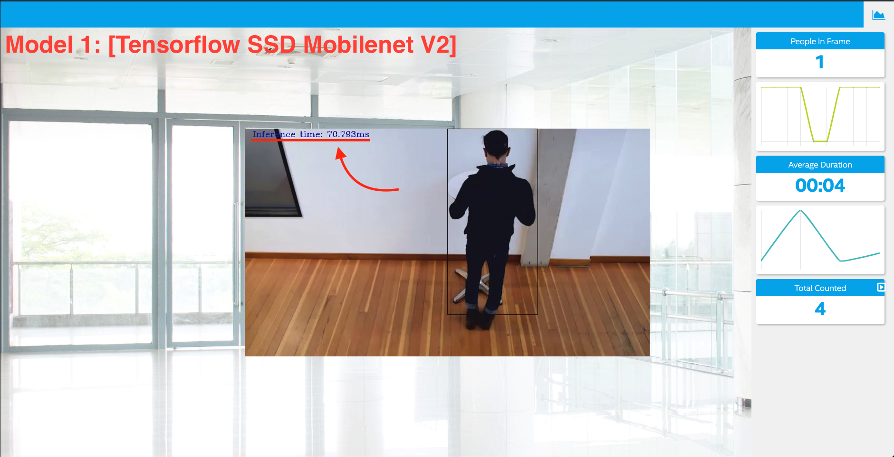
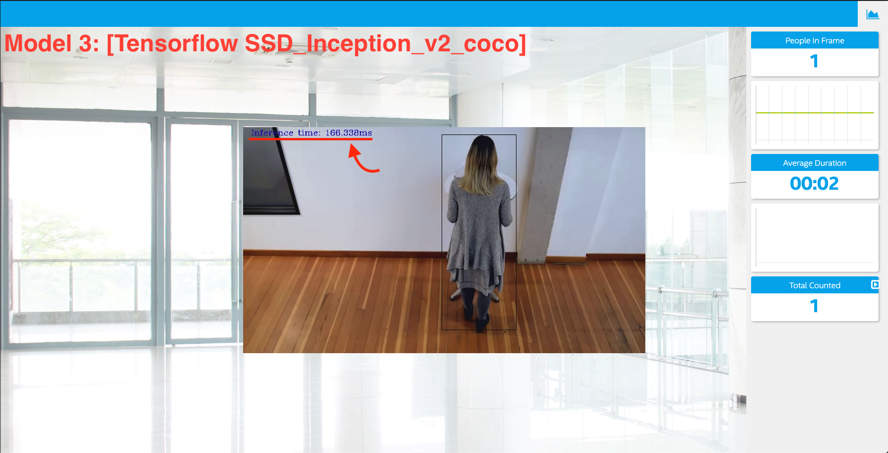
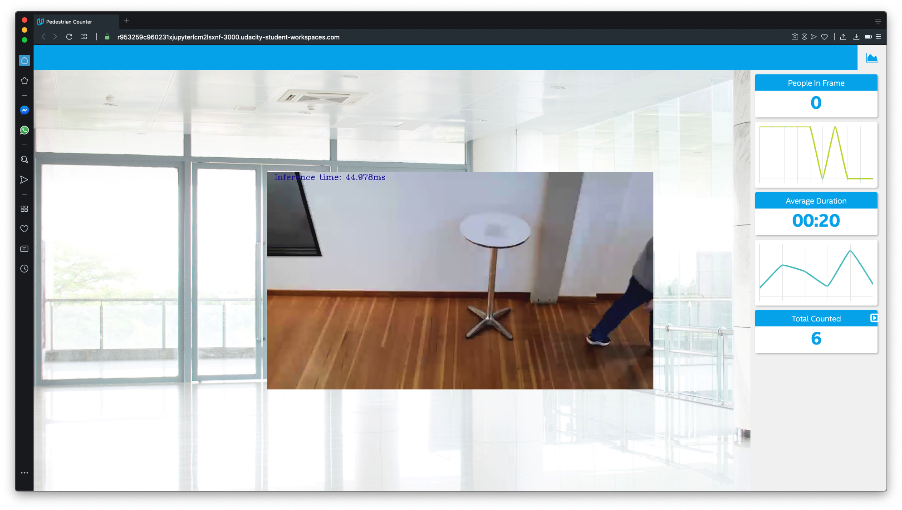

# Project Write-Up
Detect people in a designated area and determine the number of people in the frame, the average time they are in the frame, and the total count. Gain important business insight using the information generated.

## Explaining Custom Layers

We can just see when we run the Model Optimizer what will convert as supported layers. Check out the full list of supported layers [here](https://docs.openvinotoolkit.org/2019_R3/_docs_MO_DG_prepare_model_Supported_Frameworks_Layers.html) actually any layer not in that list is automatically classified as custome layer by Model Optimizer. What happens when a layer isn’t supported by the Model Optimizer? One potential solution is the use of custom layers. Another solution is actually running the given unsupported layer in its original framework. For example, you could potentially use TensorFlow to load and process the inputs and outputs for a specific layer you built in that framework, if it isn’t supported with the Model Optimizer. Lastly, there are also unsupported layers for certain hardware, that you may run into when working with the Inference Engine. In this case, there are sometimes extensions available that can add support. 

To actually add custom layers, there are a few differences depending on the original model framework. In both TensorFlow and Caffe, the first option is to register the custom layers as extensions to the Model Optimizer.

For Caffe, the second option is to register the layers as Custom, then use Caffe to calculate the output shape of the layer. You’ll need Caffe on your system to do this option.

For TensorFlow, its second option is to actually replace the unsupported subgraph with a different subgraph. The final TensorFlow option is to actually offload the computation of the subgraph back to TensorFlow during inference.

## Comparing Model Performance

My method(s) to compare models before and after conversion to Intermediate Representations
were...

The difference between model accuracy pre- and post-conversion was...

The size of the model pre- and post-conversion was...
1. [Tensorflow SSD Mobilenet V2]
  - Before:  179 MB
  - After:   67 MB
2. [Tensorflow SSD_ResNet_50_fpn_coco]
  - Before:  350 MB
  - After:   197 MB
3. [Tensorflow SSD_Inception_v2_coco]
  - Before:  265 MB
  - After:   95 MB

The inference time of the model pre- and post-conversion was...
1. [Tensorflow SSD Mobilenet V2]
  - Inference time: 70.793ms
  

2. [Tensorflow SSD_ResNet_50_fpn_coco]
  - Inference time: 2720.525ms
  

3. [Tensorflow SSD_Inception_v2_coco]
  - Inference time: 166.338ms
  

## Assess Model Use Cases

1.  This app can be used in big stores to evaluate customer check-out points queues to determine if need to add more queues or not based on number of people in each queue.
2. The program can be used for social activities such as marches and street campaigns and estimates the number of participants.
3. The program can be used at public transport system stations and increases or decreases the number of public transport services depending on the crowd.

In general, the program is applicable to scenarios where the number of people present at the site is highly variable over time.

## Assess Effects on End User Needs
This is a pedestrian detector for the Retail scenario. It is based on MobileNetV2-like backbone that includes depth-wise convolutions to reduce the amount of computation for the 3x3 convolution block. The single SSD head from 1/16 scale feature map has 12 clustered prior boxes.

### Example

**Pose coverage:** Standing upright, parallel to image plane
**Support of occluded pedestrians:** Yes
**Occlusion coverage:**	<50%
**Min pedestrian height:**	100 pixels (on 1080p)
**Input Image Size:** image height 320 x image width 544
**Outputs:** label, bounding box

## Model Research

[This heading is only required if a suitable model was not found after trying out at least three
different models. However, you may also use this heading to detail how you converted 
a successful model.]

In investigating potential people counter models, I tried each of the following three models:

- Model 1: [Tensorflow SSD Mobilenet V2]
  - [http://download.tensorflow.org/models/object_detection/ssd_mobilenet_v2_coco_2018_03_29.tar.gz]
  
  - I converted the model to an Intermediate Representation with the following arguments
    `python /opt/intel/openvino/deployment_tools/model_optimizer/mo.py --input_model frozen_inference_graph.pb --tensorflow_object_detection_api_pipeline_config pipeline.config --reverse_input_channels --tensorflow_use_custom_operations_config /opt/intel/openvino/deployment_tools/model_optimizer/extensions/front/tf/ssd_v2_support.json
`
  - The model was insufficient for the app because...
  The information provided is inaccurate for the number of people and the average time they were present. 
  
  - I tried to improve the model for the app by...
  Do additional processing of the output to handle incorrect detections, such as adjusting confidence threshold or accounting for 1-2 frames where the model fails to see a person already counted and would otherwise double count.
  
- Model 2: [Tensorflow SSD_ResNet_50_fpn_coco]
  - [http://download.tensorflow.org/models/object_detection/ssd_resnet50_v1_fpn_shared_box_predictor_640x640_coco14_sync_2018_07_03.tar.gz]
  - I converted the model to an Intermediate Representation with the following arguments...
  `python /opt/intel/openvino/deployment_tools/model_optimizer/mo.py --input_model frozen_inference_graph.pb --tensorflow_object_detection_api_pipeline_config pipeline.config --reverse_input_channels --tensorflow_use_custom_operations_config /opt/intel/openvino/deployment_tools/model_optimizer/extensions/front/tf/ssd_v2_support.json
`
  - The model was insufficient for the app because...
  This model was very very slow.
  
  - I tried to improve the model for the app by...
  Do additional processing of the output to handle incorrect detections, such as adjusting confidence threshold or accounting for 1-2 frames where the model fails to see a person already counted and would otherwise double count.

- Model 3: [Tensorflow SSD_Inception_v2_coco]
  - [http://download.tensorflow.org/models/object_detection/ssd_inception_v2_coco_2018_01_28.tar.gz]
  
  - I converted the model to an Intermediate Representation with the following arguments...
  `python /opt/intel/openvino/deployment_tools/model_optimizer/mo.py --input_model frozen_inference_graph.pb --tensorflow_object_detection_api_pipeline_config pipeline.config --reverse_input_channels --tensorflow_use_custom_operations_config /opt/intel/openvino/deployment_tools/model_optimizer/extensions/front/tf/ssd_v2_support.json
`

  - The model was insufficient for the app because...
    This model was faster than the second model but had a very poor accuracy and calculated a lot more people than reality. 
    
  - I tried to improve the model for the app by...
  Do additional processing of the output to handle incorrect detections, such as adjusting confidence threshold or accounting for 1-2 frames where the model fails to see a person already counted and would otherwise double count.

## What model I've used

- Final model: [person-detection-retail-0013]
[https://docs.openvinotoolkit.org/latest/_models_intel_person_detection_retail_0013_description_person_detection_retail_0013.html]

I used the _person-detection-retail-0013 Intel® model_, that can be accessed using the model downloader. The model downloader downloads the .xml and .bin files that will be used in this project.

### Download the .xml and .bin files

Go to the **model downloader** directory present inside Intel® Distribution of OpenVINO™ toolkit:

`cd /opt/intel/openvino/deployment_tools/tools/model_downloader
`

Specify which model to download with `--name`. To download the _person-detection-retail-0013 model_, run the following command:

`sudo ./downloader.py --name person-detection-retail-0013 -o /home/workspace/
`

### Running on the CPU
Though by default application runs on CPU, this can also be explicitly specified by `-d CPU` command-line argument:

`
python main.py -i resources/Pedestrian_Detect_2_1_1.mp4 -m intel/person-detection-retail-0013/FP16/person-detection-retail-0013.xml -l /opt/intel/openvino/deployment_tools/inference_engine/lib/intel64/libcpu_extension_sse4.so -pt 0.5 | ffmpeg -v warning -f rawvideo -pixel_format bgr24 -video_size 768x432 -framerate 24 -i - http://0.0.0.0:3004/fac.ffm

### The result with final model
As you can see in the below screenshot, the total people counted value is **6** and the average duration value is **00:20**.

`

Sepid M.